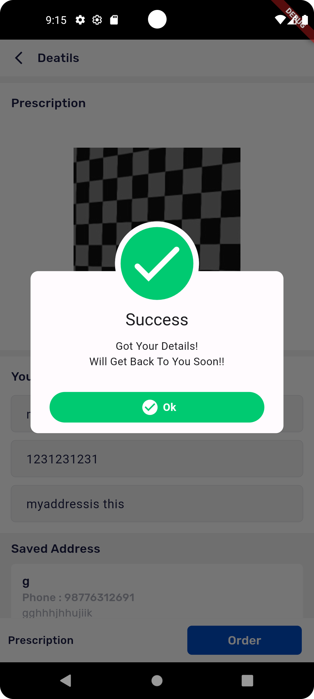
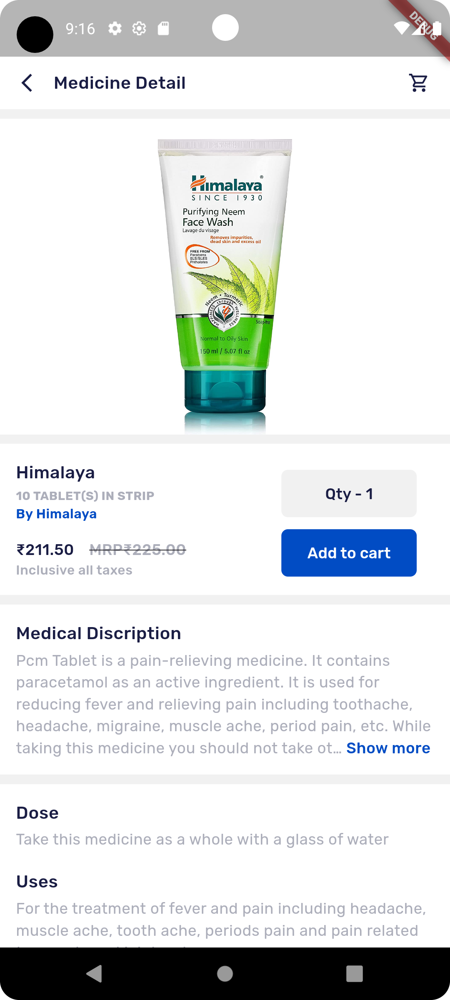
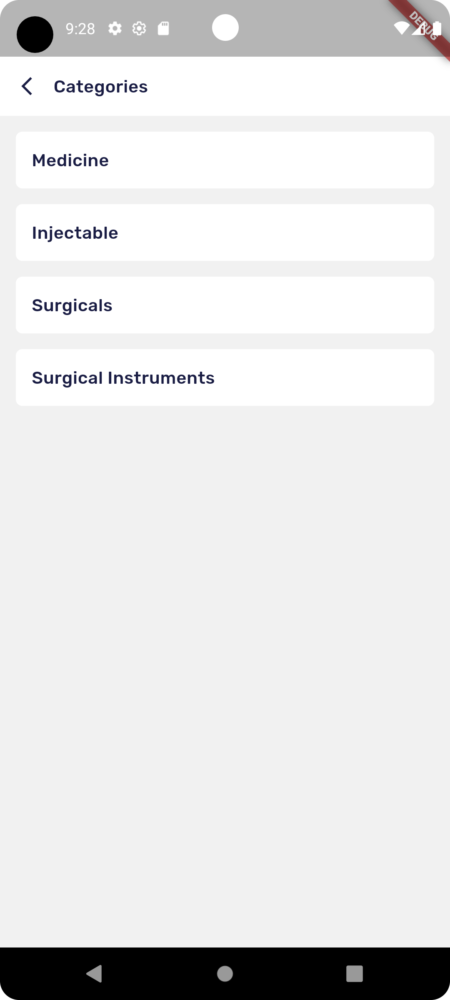

# MedSphere - Comprehensive Pharmacy Application 

This comprehensive Flutter-based mobile application encompasses a wide range of services. It empowers customers to purchase prescription-based medications, essential items, and medical equipment. Moreover, users can schedule lab tests, consult with doctors online, and utilize services such as pick-up and drop-off, home care, and emergency assistance. Furthermore, there's a specialized section for doctors, allowing them to make purchases after undergoing identity verification. In essence, it offers a centralized platform for various pharmacy-related services.

In conjunction with the application, an Admin Panel has been developed to oversee the entire system. This includes tasks such as adding new data and categories, verifying the identities of doctors, updating order statuses, and monitoring orders. 

## Screenshots
- **OnBoarding**
  

   
  
  
   
  

- **Dashboard**
  

   
   
   
   
   
   
   
  

- **Order Product**
  

   
   
   
   
   
   
   
   
  

- **Lab Testing**
  

   
   
    
  

- **Miscellaneous Features**
  

   
   
    
   
    
   
   
   
  

## Tech Stack
#### Frontend
- Frontend Framework: Flutter
- Frontend Language: Dart

#### Backend
- Database: Firestore Database
- Authentication: Firebase Authentication
- File Storage: Firebase Storage
